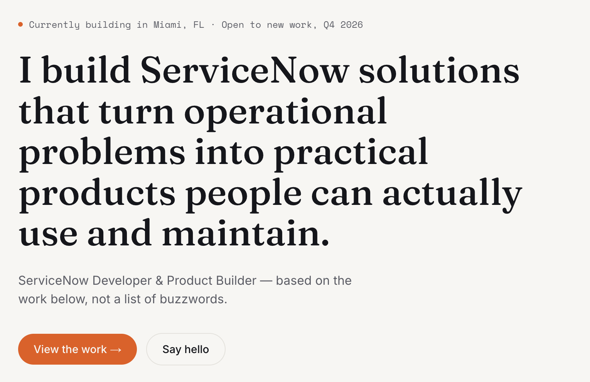

<div align="center">

# Eric P — Portfolio & Blog

Personal site built with **Astro** — selected ServiceNow / ITAM work, plus a blog for
longer posts, reusable code snippets, and troubleshooting write-ups.

[**Live site**](https://ericccp.github.io)

</div>

<br />

<div align="center">
  
</div>

<br />

## Stack

- **Astro 7** — static output, zero client-side JavaScript by default
- **Tailwind CSS v4** — CSS-first config, no `tailwind.config.js`
- **Content Collections** with a typed Zod schema — work and blog entries are just Markdown files
- **Light & dark mode** — class-based, no flash of unstyled theme on load
- **Astro Fonts API** — self-hosted Google Fonts, zero layout shift
- **View Transitions** — smooth navigation between pages
- **SEO defaults** — canonical URLs, Open Graph, Twitter cards, auto-generated sitemap
- **Strict TypeScript**, path aliases (`@/components/*`, etc.)
- Deploys to GitHub Pages via GitHub Actions on every push to `main` (see `.github/workflows/deploy.yml`)

## Sections

- **Work** (`/work`) — case studies, one Markdown file per project in `src/content/work/`
- **Blog** (`/blog`) — posts, code snippets, and solution write-ups in `src/content/blog/`,
  filterable by type on the listing page
- **About** (`/about`)

## Local development

```bash
git clone https://github.com/ericccp/ericccp.github.io.git
cd ericccp.github.io
pnpm install
pnpm dev
```

Open `http://localhost:4321`.

| Command        | Action                                             |
| -------------- | --------------------------------------------------- |
| `pnpm dev`     | Start the local dev server                         |
| `pnpm build`   | Type-check, then build for production to `./dist/` |
| `pnpm preview` | Preview the production build locally               |
| `pnpm check`   | Run `astro check` only                             |
| `pnpm format`  | Format the project with Prettier                   |

## Project structure

```text
├── public/
│   ├── favicon.svg
│   ├── og-image.png
│   └── robots.txt
├── src/
│   ├── assets/                 # static images and assets
│   ├── components/             # BaseHead, Button, Footer, Header, SectionHeading,
│   │                           # ThemeToggle, WorkRow, BlogRow
│   ├── content/
│   │   ├── work/*.md           # one file per project
│   │   └── blog/*.md           # one file per post / snippet / solution
│   ├── layouts/
│   │   └── BaseLayout.astro    # <head>, SEO, fonts, theme script
│   ├── pages/
│   │   ├── index.astro
│   │   ├── about.astro
│   │   ├── work/[id].astro
│   │   ├── blog/[id].astro
│   │   └── 404.astro
│   ├── styles/
│   │   └── global.css          # design tokens + Tailwind import
│   ├── utils/
│   │   └── formatDate.ts
│   ├── content.config.ts       # Zod schemas for "work" and "blog" collections
│   └── site.config.ts          # name, bio, email, social links, nav
├── astro.config.mjs
└── tsconfig.json
```

## Adding content

**A work entry.** Add a Markdown file to `src/content/work/`:

```md
---
title: Project Name
summary: One sentence, shown in the list view.
role: Your role on the project
date: 2026-01-15
tags: [ServiceNow, JavaScript]
url: https://example.com # optional
repo: https://github.com/... # optional
featured: true # optional, shows it first on the homepage
---

Full write-up in Markdown.
```

**A blog entry.** Add a Markdown file to `src/content/blog/`:

```md
---
title: Post Title
summary: One sentence, shown in the list view.
type: post # post | snippet | solution
date: 2026-01-15
tags: [ServiceNow]
language: JavaScript # optional, shown for snippets/solutions
featured: false
---

Full write-up in Markdown. Code fences get syntax highlighting automatically.
```

`type` drives the badge and filter on `/blog` — use `post` for long-form writing,
`snippet` for reusable code, `solution` for a specific problem and its fix.

## Customizing

**Site info.** Edit `src/site.config.ts` — name, tagline, email, social links, and nav
links are read from this one file by the header, footer, and homepage.

**Colors.** Edit the five custom properties at the top of `src/styles/global.css`
(`--paper`, `--ink`, `--ink-soft`, `--signal`, `--line`). Every component reads from
these tokens.

**Fonts.** Swap the three families in the `fonts` array in `astro.config.mjs`.

## Deploying

Static build, deployed to GitHub Pages on every push to `main` via
`.github/workflows/deploy.yml`. The `site` value in `astro.config.mjs` is set to
`https://ericccp.github.io` and drives the sitemap and canonical URLs — update it if
the domain ever changes.

## License

MIT — see [LICENSE](./LICENSE).
