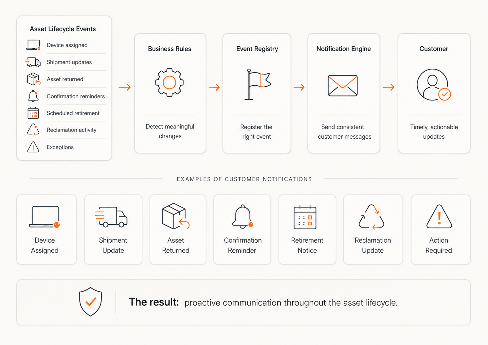

Asset processes were moving forward in ServiceNow, but customers often had limited visibility into what was happening.

There were gaps during fulfillment, when an employee needed to take action, when an exception occurred, and when a transaction was complete. The process worked, but the communication around it was inconsistent.

I created an MVP set of asset lifecycle events and used them to drive customer notifications. Business Rules detect meaningful changes, register the appropriate event, and let the ServiceNow notification engine handle the message.

The first set covered moments such as:

* Device assignment
* Shipment updates
* Asset returns
* Confirmation reminders
* Scheduled retirement
* Reclamation activity
* Exceptions and overdue actions

I also introduced a reusable notification template so each message had a consistent structure, clear asset details, and a visible call to action.

For asset confirmations, I added a weekly reminder process that identifies users with outstanding actions and sends a single reminder covering their open items.

**The result**

Customers received clearer updates throughout the asset lifecycle, while the support team gained a more maintainable way to introduce new communications.

The event-driven approach also created a reusable foundation. New lifecycle notifications can now be added without tightly coupling email logic to individual processes.

**What comes next**

The next phase is to expand coverage across more lifecycle events, including repair, refresh, disposal, warranty status, and additional exception scenarios.
